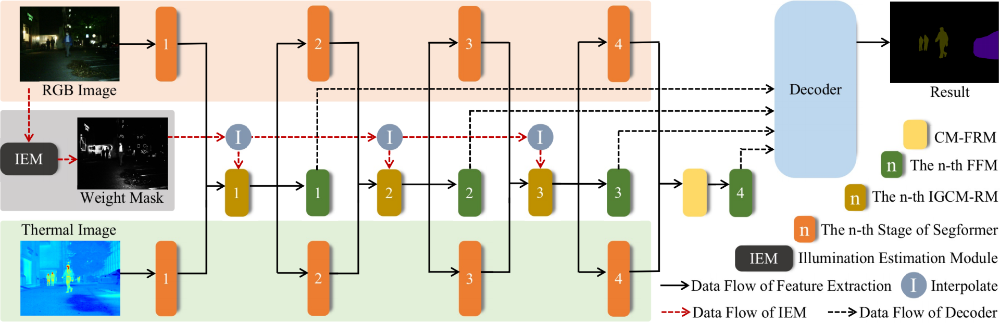

# IGFNet-Pytorch
The official pytorch implementation of **IGFNet: Illumination-Guided Fusion Network for Semantic Scene Understanding using RGB-Thermal Images**.

We test our code in Python 3.6.9, CUDA 11.1, cuDNN 8, and PyTorch 1.10.1.
<div align=center>

</div>


# Introduction
IGFNet introduces an interpretable RGB-Thermal fusion network and utilize illumination to guide the fusion of multi-modal features, which includes an Illumination Estimation Module (IEM) and an Illumination-Guided-Cross-Modal Rectification Module (IGCM-RM).

# Dataset
The dataset can be downloaded from the MFNet project [page](https://www.mi.t.u-tokyo.ac.jp/static/projects/mil_multispectral/).

# Pretrained weights
The pretrained weight of IGFNet can be downloaded from [here](https://drive.google.com/drive/folders/1Hqah45kpfSmf87C4Z2JQLN5d0dMAp3Ip?usp=drive_link)

# Usage
* Clone this repo
```
$ git clone https://github.com/lab-sun/IGFNet.git
```
* Build docker image
```
$ cd ~/IGFNet
$ docker build -t docker_image_igfnet .
```
* Download the dataset
```
$ (You should be in the IGFNet folder)
$ mkdir ./datasets
$ cd ./datasets
$ (download our preprocessed dataset.zip in this folder)
$ unzip -d .. dataset.zip
```
* To reproduce our results, you need to download our pretrained weights.
```
$ (You should be in the IGFNet folder)
$ mkdir ./pretrained
$ cd ./pretrained
$ docker run -it --shm-size 8G -p 1234:6006 --name docker_container_igfnet --gpus all -v ~/IGFNet:/workspace docker_image_igfnet
$ cd /workspace
$ python3 train.py
```
* To see the training process
```
$ (fire up another terminal)
$ docker exec -it docker_container_igfnet /bin/bash
$ cd /workspace
$ tensorboard --bind_all --logdir=./runs/tensorboard_log/
$ (fire up your favorite browser with http://localhost:1234, you will see the tensorboard)
```
The results will be saved in the `./runs` folder.
Note: Please change the smoothing factor in the Tensorboard webpage to `0.999`, otherwise, you may not find the patterns from the noisy plots. If you have the error `docker: Error response from daemon: could not select device driver`, please first install [NVIDIA Container Toolkit](https://docs.nvidia.com/datacenter/cloud-native/container-toolkit/install-guide.html) on your computer!

# Acknowledgement
Some of the codes are borrowed from [CMX](https://github.com/huaaaliu/RGBX_Semantic_Segmentation)

Contact: yx.sun@polyu.edu.hk

Website: https://yuxiangsun.github.io/
